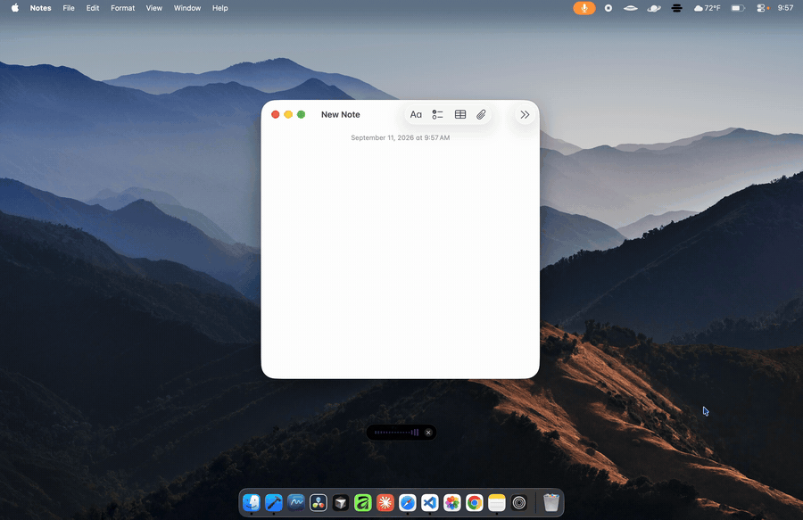

# Voz

Speech to text on your Mac, that never leaves your Mac.
Press a hotkey, talk, press it again — the words appear wherever your cursor is.
No account, no subscription, no audio leaving the machine.



Nothing in that clip is talking to a server. The Whisper model is inside the
app bundle, so it works the same with the wifi off — which is the fastest way
to check the claim rather than take it on trust.

This is the complete source. It builds into the same app that is sold at
[vozwhisper.com](https://www.vozwhisper.com).

---

## Free if you build it. $2.99 if you'd rather not.

Both are honest options, so here is the actual difference:

| | Build from source | [Buy it](https://www.vozwhisper.com) |
|---|---|---|
| Price | Free | $2.99, once |
| Setup | Xcode, cmake, ~20 min of compiling | Drag to Applications |
| Signed & notarized by Apple | No — you'll click through Gatekeeper | Yes |
| Updates | `git pull`, build again | Installs itself |
| Network requests | No update feed in this build. The only egress is the optional AI model download, if you ask for it | One a day, version number only, switchable off — plus that same optional download |

If you are comfortable with the four commands below, build it — that is what
this repo is for, and nothing is held back. If "install cmake and wait for
whisper.cpp to compile" sounds like a bad evening, three dollars buys you the
same app with none of it.

## Build it

```bash
git clone https://github.com/quietbin/voz-mac
cd voz-mac
./scripts/setup.sh        # model + whisper.cpp + llama.cpp. Grab a coffee.
open Voz.xcodeproj        # then ⌘R
```

`setup.sh` is required, not optional — Xcode treats the speech model as a
bundled resource, so the build fails without it.

macOS will ask for two permissions on first run:

- **Microphone**, to hear you.
- **Accessibility**, so Voz can type into other apps. System Settings ▸
  Privacy & Security ▸ Accessibility.

Set `SKIP_LLAMA=1` if you only want dictation and don't care about the
optional AI features.

## What it does

- **Dictate** — a global hotkey (default ⌥Space) records, transcribes and
  pastes into whatever app you're in. 16 languages, auto-detected, plus custom
  vocabulary so it stops mangling your colleagues' names.
- **Meetings** — record a call and keep the notes locally.
- **Transcribe** — drop in an audio or video file you already have.
- **History** — everything you've dictated, searchable.
- **Optional local AI** — summaries, meeting follow-ups and speaker separation
  from a Qwen 2.5 model you download once and which then runs on your Mac.
  Off until you turn it on. Speaker separation works by reading the transcript
  and inferring turns from the wording, not by telling voices apart.

## How the privacy claim actually holds

Not a policy — a structure. There is no server to send audio to, no account to
attach it to, and no analytics anywhere in this repo. Transcription is
`whisper.cpp` running as a subprocess on your machine; the audio buffer is
discarded the moment it becomes text.

The easiest way to verify it is to stop reading and turn on Airplane Mode.
Everything still works.

This build goes further than the paid one: it has no updater, so it never
phones home about versions. The **one** thing that can touch the network is the
optional AI model download — once per model, only if you ask for it, carrying
nothing but the request for the file. Decline the AI features and this build
makes no network requests at all.

## What's not here

- **The Sparkle updater and its signing key.** The key is what lets an update be
  trusted; publishing it would let anyone push code to every installed copy.
  `Voz/Updater.swift` is a stub explaining this.
- **Payment, licensing and delivery.** They aren't part of the app.
- **A notarized build.** Apple's notarization is tied to a paid developer
  account, so a source build is one you have chosen to trust.

## Built on

[whisper.cpp](https://github.com/ggerganov/whisper.cpp) and
[llama.cpp](https://github.com/ggml-org/llama.cpp) by Georgi Gerganov and
contributors, both MIT. Speech model is OpenAI's Whisper (base).

## Licence

GPL-3.0 — see [LICENSE](LICENSE). Build it, change it, share it. If you distribute
a modified version, publish your source too.

Copyright © 2026 Quiet Bin.
